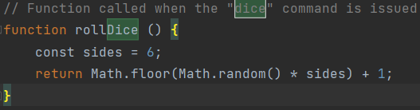
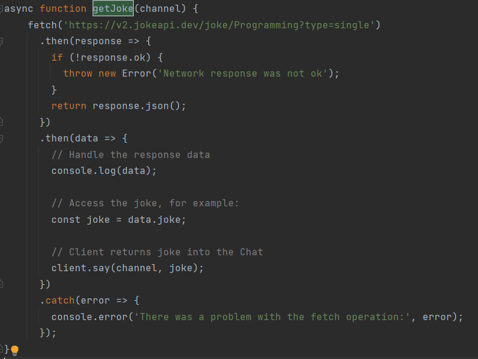
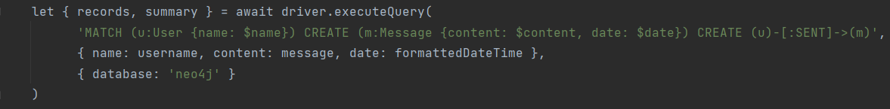

# Twitch-Bot-with-Neo4J

Dieses Projekt dient nur als Nebenprojekt, da zu beginn des Moduls Probleme mit dem ausführen von Python auf dem Mac entstanden sind.
Deswegen wurde dieser Twitch Bot mit JavaScript umgesetzt.

## Twitch Libary

Um von JavaScript aus mit Twitch zu komunizieren, wurde folgende Libary verwendet: https://tmijs.com
Über diese Libary, kann man Nachrichten aus einem Twitch Chat ausverten, verwalten, schreiben, user bannen usw.

## Neo4j Libary

Um mit Neo4j Datenbank zu interagieren, wurde folgende Libary verwendet: https://www.npmjs.com/package/neo4j-driver
Mithilfe dieser Libary können Daten mithilfe von JavaScript auf die Datenbank geschrieben, gelesen, gelöscht usw. werden.

## Twitch Bot Umfang

Der Twitch Bot hat nicht so viele Funktionen, aber das Grundprizet der Interaktion mit der Datenbank und Twitch funktioniert flüssig.

Mit dem Command !dice, würfelt der Twitch Bot einen Würfel und schreibt, das Resultat zurück in den Chat.

Mit dem Command !joke, kann man eine Api abfragen, welche einem einen Witz zurückgibt. Die Api hat einige Paramete, welche übergeben werden können. Wir habe probiert, diese über eine Konfiguration, welche man ebenfalls über den Chat ändern kann zu nutzen,
aber die Zeit hat nicht ganz gereicht, um dies fertig zu stellen.

Auf dem Bild unten, sieht man einen auschnitt, wie die Nachrichten aus dem Chat in die Datenbank
gespeichert werden.

